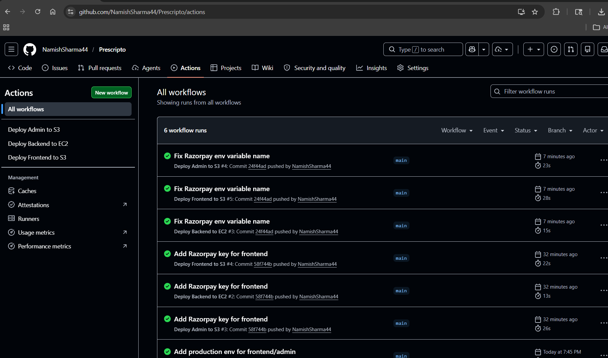
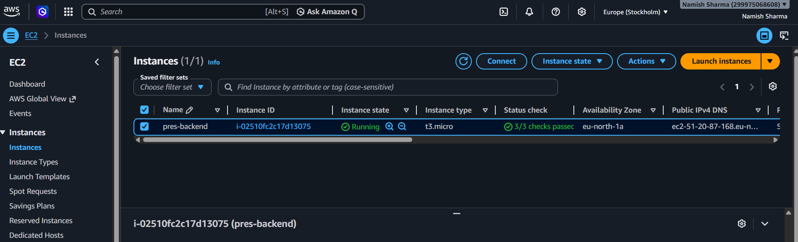
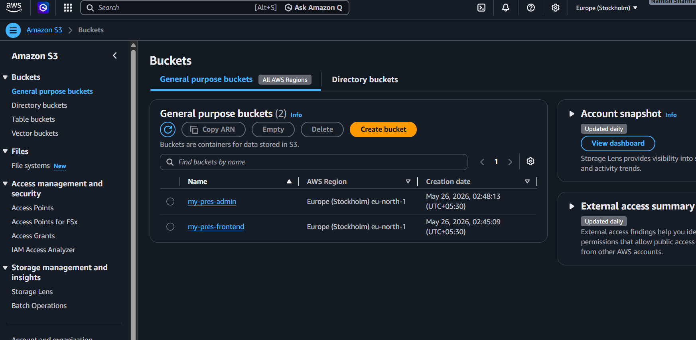

# 🏥 Prescripto - Doctor Appointment Booking System

> A comprehensive full-stack healthcare application that connects patients with trusted medical professionals. The platform features separate interfaces for patients, doctors, and administrators, enabling seamless appointment scheduling, management, and healthcare service delivery.

[](https://reactjs.org/)
[](https://nodejs.org/)
[](https://www.mongodb.com/)
[](LICENSE)

---

## 🌟 Features

### 👨‍⚕️ Patient Portal (Frontend)
- 🔐 **User Authentication**: Secure registration and login system
- 🔍 **Doctor Discovery**: Browse doctors by speciality (General Physician, Gynecologist, Dermatologist, Pediatricians, Neurologist, Gastroenterologist)
- 📅 **Appointment Booking**: Real-time slot availability and booking system
- 👤 **Profile Management**: Update personal information and profile pictures
- 📋 **Appointment History**: View, track, and cancel appointments
- 💳 **Payment Integration**: Multiple payment options (Razorpay, Cash)
- 📱 **Responsive Design**: Mobile-first approach with Tailwind CSS

### 🛡️ Admin Panel
- 📊 **Dashboard**: Overview of doctors, appointments, and patients statistics
- 👨‍⚕️ **Doctor Management**: Add, view, and manage doctor profiles
- 📅 **Appointment Management**: View all appointments and cancel if needed
- ⚡ **Availability Control**: Toggle doctor availability status
- 📈 **Comprehensive Analytics**: Latest bookings and system insights

### 🩺 Doctor Portal
- 💼 **Personal Dashboard**: Earnings, appointments, and patient statistics
- 📅 **Appointment Management**: View, complete, or cancel appointments
- ⚙️ **Profile Management**: Update professional information, fees, and availability
- 👥 **Patient Information**: Access to patient details and appointment history

---

## 🛠️ Tech Stack

### 🎨 Frontend
| Technology | Version | Purpose |
|------------|---------|---------|
| ⚛️ React | 19.1.1 | UI library |
| ⚡ Vite | 5.0.3 | Build tool and dev server |
| 🧭 React Router DOM | 7.9.3 | Client-side routing |
| 🌐 Axios | 1.12.2 | HTTP client |
| 🎨 Tailwind CSS | 3.4.21 | Utility-first CSS framework |
| 🔔 React Toastify | 11.0.5 | Toast notifications |
| 📝 ESLint | 9.36.0 | Code linting |

### 🖥️ Backend( RESTful API Server)
| Technology | Version | Purpose |
|------------|---------|---------|
| 🟢 Node.js + Express | 5.1.0 | Server framework |
| 🍃 MongoDB + Mongoose | 8.19.0 | Database and ODM |
| ☁️ Cloudinary | 2.7.0 | Image storage and management |
| 📤 Multer | 2.0.2 | File upload middleware |
| 🔑 JWT | 9.0.2 | Authentication tokens |
| 🔒 Bcrypt | 6.0.0 | Password hashing |
| 💰 Razorpay | 2.9.6 | Payment gateway integration |
| ✅ Validator | 13.15.15 | Data validation |
| 🌐 CORS | 2.8.5 | Cross-origin resource sharing |
| 🔧 Dotenv | 17.2.3 | Environment variable management |

### 🎛️ Admin Panel
| Technology | Version | Purpose |
|------------|---------|---------|
| ⚛️ React | 19.1.1 | UI library |
| ⚡ Vite | 5.0.4 | Build tool |
| 🧭 React Router DOM | 7.9.3 | Routing |
| 🌐 Axios | 1.12.2 | HTTP client |
| 🎨 Tailwind CSS | 3.4.21 | Styling |
| 🔔 React Toastify | 11.0.5 | Notifications |

---

## 📁 Project Structure

```
prescripto/
│
├── 🎨 frontend/                    # Patient-facing application
│   ├── 📂 public/                 # Static assets
│   ├── 📂 src/
│   │   ├── 🖼️ assets/            # Images, icons, and static data
│   │   ├── 🧩 components/        # Reusable React components
│   │   │   ├── Banner.jsx
│   │   │   ├── Footer.jsx
│   │   │   ├── Header.jsx
│   │   │   ├── Navbar.jsx
│   │   │   ├── RelatedDoctors.jsx
│   │   │   ├── SpecialityMenu.jsx
│   │   │   └── TopDoctors.jsx
│   │   ├── 🔄 contexts/          # React Context providers
│   │   │   └── AppContext.jsx
│   │   ├── 📄 pages/             # Page components
│   │   │   ├── about.jsx
│   │   │   ├── appointment.jsx
│   │   │   ├── contact.jsx
│   │   │   ├── doctors.jsx
│   │   │   ├── home.jsx
│   │   │   ├── login.jsx
│   │   │   ├── myappointment.jsx
│   │   │   └── myprofile.jsx
│   │   ├── App.jsx            # Main app component
│   │   ├── main.jsx           # Entry point
│   │   └── index.css          # Global styles
│   ├── .env                   # Environment variables
│   ├── 📦 package.json
│   ├── ⚙️ tailwind.config.js
│   └── ⚡ vite.config.js
│
├── 🛡️ admin/                      # Admin & Doctor panel
│   ├── 📂 public/
│   ├── 📂 src/
│   │   ├── 🖼️ assets/            # Admin-specific assets
│   │   ├── 🧩 components/
│   │   │   ├── Navbar.jsx
│   │   │   └── Sidebar.jsx
│   │   ├── 🔄 context/           # Context providers
│   │   │   ├── AdminContext.jsx
│   │   │   ├── AppContext.jsx
│   │   │   └── DoctorContext.jsx
│   │   ├── 📄 pages/
│   │   │   ├── 👨‍💼 Admin/         # Admin-specific pages
│   │   │   │   ├── AddDoctor.jsx
│   │   │   │   ├── CallAppointments.jsx
│   │   │   │   ├── Dashboard.jsx
│   │   │   │   └── DoctorsList.jsx
│   │   │   ├── 🩺 Doctor/        # Doctor-specific pages
│   │   │   │   ├── DoctorAppointments.jsx
│   │   │   │   ├── DoctorDashboard.jsx
│   │   │   │   └── DoctorProfile.jsx
│   │   │   └── Login.jsx
│   │   ├── App.jsx
│   │   ├── main.jsx
│   │   └── index.css
│   ├── .env
│   ├── 📦 package.json
│   ├── ⚙️ tailwind.config.js
│   └── ⚡ vite.config.js
│
├── 🖥️ backend/                    # Node.js server
│   ├── ⚙️ config/
│   │   ├── cloudinary.js      # Cloudinary configuration
│   │   └── mongodb.js         # MongoDB connection
│   ├── 🎮 controllers/           # Business logic
│   │   ├── adminController.js
│   │   ├── doctorController.js
│   │   └── userController.js
│   ├── 🛡️ middlewares/           # Custom middleware
│   │   ├── authAdmin.js
│   │   ├── authDoctor.js
│   │   ├── authUser.js
│   │   └── multer.js
│   ├── 📊 models/                # Mongoose schemas
│   │   ├── appointmentModel.js
│   │   ├── doctorModel.js
│   │   └── userModels.js
│   ├── 🛣️ routes/                # API routes
│   │   ├── adminRoute.js
│   │   ├── doctorRoute.js
│   │   └── userRoute.js
│   ├── 📤 uploads/               # Temporary file uploads
│   ├── .env                   # Environment variables
│   ├── 📦 package.json
│   └── 🚀 server.js              # Entry point
│
└── 🖼️ assets/                     # Shared assets
    ├── assets_admin/
    └── assets_frontend/
```


## 🗄️ Database Models

### 👤 User Model
```javascript
{
  name: String,
  email: String,
  password: String (hashed),
  image: String (Cloudinary URL),
  address: Object,
  gender: String,
  dob: String,
  phone: String
}
```

### 👨‍⚕️ Doctor Model
```javascript
{
  name: String,
  email: String,
  password: String (hashed),
  image: String (Cloudinary URL),
  speciality: String,
  degree: String,
  experience: String,
  about: String,
  fees: Number,
  address: Object,
  available: Boolean,
  slots_booked: Object
}
```

### 📅 Appointment Model
```javascript
{
  userId: ObjectId,
  docId: ObjectId,
  slotDate: String,
  slotTime: String,
  userData: Object (embedded),
  docData: Object (embedded),
  amount: Number,
  date: Number,
  cancelled: Boolean,
  payment: Boolean,
  isCompleted: Boolean
}
```

---

## 🔒 Authentication & Authorization

- 🔑 **JWT-based authentication** for all three user types
- 🛡️ **Role-based access control** using separate middleware
  - `authUser.js` - Patient authentication
  - `authDoctor.js` - Doctor authentication
  - `authAdmin.js` - Admin authentication
- 🔐 **Password encryption** using bcrypt
- 💾 **Secure token storage** in localStorage

---

## 🎨 UI/UX Features

- 📱 **Responsive Design**: Mobile-first approach with Tailwind CSS
- ✨ **Smooth Animations**: Hover effects and transitions
- 🔔 **Toast Notifications**: Real-time feedback using React Toastify
- ✅ **Form Validation**: Client and server-side validation
- ⏳ **Loading States**: Visual feedback during async operations
- ❌ **Error Handling**: Comprehensive error messages

---

## 💳 Payment Integration

- 💰 **Razorpay Integration** for online payments
- 💵 **Cash on Appointment** option available
- ✅ **Payment verification** with backend validation
- 🔒 **Secure transaction handling**

---

## 📸 Image Management

- ☁️ **Cloudinary integration** for image storage
- ⚡ **Automatic image optimization**
- 🔒 **Secure upload** using Multer middleware
- 👤 **Default profile images** for users

---

## 🔧 Development

### 📜 Available Scripts

**Backend:**
```bash
npm start          # Start production server
npm run server     # Start development server with nodemon
```

**Frontend & Admin:**
```bash
npm run dev        # Start development server
npm run build      # Build for production
npm run preview    # Preview production build
npm run lint       # Run ESLint
```

---

## 🌐 Deployment (AWS + CI/CD)

### ✅ AWS Services Used
- 🖥️ **EC2**: Hosts the Node.js backend
- 🗂️ **S3**: Hosts the Frontend and Admin static builds
- 🔐 **IAM**: GitHub Actions access to AWS

### 🔁 CI/CD Flow (Sequential)
1. ✍️ Make a code change locally
2. ✅ Commit and push to GitHub
3. 🤖 GitHub Actions runs automatically
4. 🚀 Backend deploys to EC2
5. 📦 Frontend/Admin build and deploy to S3
6. ✅ The live app updates instantly

### 📸 AWS & CI/CD Screenshots




### ⚠️ Free Trial Note
- This deployment uses an AWS Free Tier account.
- After the free trial ends or if billing is not enabled, the EC2 public IP may change or become unavailable.

---

## 🤝 Contributing

Contributions are welcome! 🎉 Please follow these steps:

1. 🍴 Fork the repository
2. 🌿 Create a feature branch (`git checkout -b feature/AmazingFeature`)
3. 💾 Commit your changes (`git commit -m 'Add some AmazingFeature'`)
4. 📤 Push to the branch (`git push origin feature/AmazingFeature`)
5. 🔃 Open a Pull Request

---

## 📝 License

This project is licensed under the **ISC License**. 📜

---

## 👥 Authors

- *Namish Shrama* 🚀

---

## 🙏 Acknowledgments

- 👨‍⚕️ Doctors and medical professionals for feature suggestions
- 🎨 UI/UX inspiration from modern healthcare platforms
- 🌟 Open-source community for amazing tools and libraries

---


